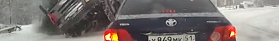
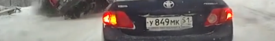

# Adding a detector to Thumbor
This is an example of adding your own detector to Thumbor as described in [https://thumbor.readthedocs.io/en/latest/custom_detection.html](). Thumbor ships with a face detector and a feature detector but what if we want our own custom detector to look for kangaroos? I don't have a kangaroo haar cascade...yet... but I can borrow the Russian number plate detector from the OpenCV github repo at [https://github.com/opencv/opencv/blob/master/data/haarcascades/haarcascade_licence_plate_rus_16stages.xml]().

The `positive-sample.png` image that we use to confirm success came from http://carhoots.com//wp-content/uploads/2014/03/Screen-Shot-2014-03-18-at-15.00.49.png.

We define our own detector in `rus_pl8_detector.py` and extend the [apsl/thumbor](https://hub.docker.com/r/apsl/thumbor/) Docker image so we can copy the haar cascade and our detector into the image.

**Disclaimer**: I'm still learning Python so don't assume this is the pythonic way. Copying files directly into site-packages feels dirty and the `PYTHONPATH` env variable is probably a better way of doing it. Packages called 'blah' probably aren't good practice either.

# Running it

### Requirements
 - Docker
 - cURL (or some other way to POST images to the server)

First, open a terminal to this cloned repo's directory:

    cd <this repo>

Build the Docker image:

    docker build -t local/extra-detector-thumbor -f extra-thumbor-classifier.dockerfile .

Run the built Docker image in the background:

    docker run -d -e UPLOAD_ENABLED=True -p 8000:8000 --name edt local/extra-detector-thumbor

Upload our sample image to the Thumbor server. You could also make sure the image is hosted somewhere publicly accessible and then pass that URL to Thumbor but for this example, we'll upload it to the server because it's easier:

    curl -v -F "media=@positive-sample.png" http://localhost:8000/image
    ...
    < Location: /image/60d489ce90ec4735a6f8be7b97ec1352/positive-sample.png
    ...

Take note of the `Location` header in the response above. You need to copy the last two segments of the Location response header to your clipboard for use in making some URLs. In our example above, that means copy:

    60d489ce90ec4735a6f8be7b97ec1352/positive-sample.png

Now create a URL by combining `http://localhost:8000/unsafe/400x60/` with the fragment on your clipboard to get:

    http://localhost:8000/unsafe/400x60/60d489ce90ec4735a6f8be7b97ec1352/positive-sample.png

Open that URL in your web browser and you'll see a cropped image that doesn't use our detector. This means we get half the number plate cut off:

Now we edit the URL we created above to add a `/smart/` fragment to enable the use of our detector. We add it after the crop size to get a URL of:

    http://localhost:8000/unsafe/400x60/smart/60d489ce90ec4735a6f8be7b97ec1352/positive-sample.png

Open that URL in your browser and you'll see a better cropping job. Our detector has worked, found the number plate and marked it as a focus point. The crop then happens around the number plate. You should see the following:

Finally you can clean up by stopping and deleting the running docker container and deleting the built image:

    docker rm -f edt
    docker rmi local/extra-detector-thumbor
